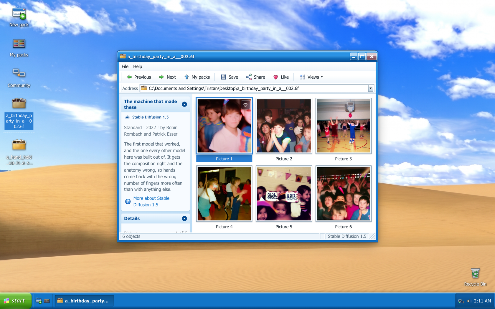

<div align="center">


# SIXFINGERS

### Type a phrase. Six pictures arrive in a folder you have to knock on to open.

**[→ Open it. sixfingers.vercel.app](https://sixfingers.vercel.app)**

No account. No key. No payment. No advertising. Nothing to install.



</div>

---

## What it is

A small website dressed as an operating system from 2001.

You type something. One request goes out to the [AI Horde](https://aihorde.net) —
a few hundred people who lend their graphics cards away for free — and six
pictures come back as a **sealed folder on your desktop**. You knock on it three
times. It gives.

The pictures are made by Stable Diffusion 1.5, the model that got composition
right and anatomy wrong. Hands come back with the wrong number of fingers more
often than with anything since. **That is where the name comes from**, and it is
the joke the whole site is built around.

Everything you make stays in your browser. Nothing is uploaded, nothing is
tracked, and there is no server that could hold your pictures even if it wanted
to.

---

## What this repository is

**This is not the site.** The site is closed source and all rights reserved.

This repository is the **open shelf**: the catalogue of picture machines the site
knows how to ask, the rules a machine has to meet, a checker anybody can run, and
the discussions where people talk about it.

> **The code is closed and the shelf is open.** Those two turn out to be
> separable, because *adding a model is not adding code* — a machine here is a
> record, never a program. There is no field for code, and there never will be, so
> there is nothing to escape from. That single decision is what makes it safe to
> let strangers add things.

---

## The easiest way to contribute, and you do not need to write anything

The AI Horde carries **163 image models**, and every one of them has at least one
volunteer running it right now. They are free, they need no key, and the site
already knows how to drive them.

So the useful work here is not technical, it is **editorial**:

> **Which of the 163 is worth having, and why?**

Which one is fast. Which one draws instead of photographing. Which one is good at
faces and hopeless at hands. Which one fails in the funniest way. Nobody has
tried them all, and the answer changes as volunteers come and go.

**To propose one**, all you need is its name on the Horde and a sentence about
what it actually does — not what it advertises:

```json
{
  "spec": 1,
  "kind": "horde",
  "id": "deliberate",
  "name": "Deliberate",
  "set": "Painterly",
  "model": "Deliberate",
  "note": "One sentence, on the object.",
  "what": "What comes back. Not what it promises.",
  "measured": { "on": "2026-08-26", "pack_seconds": 52.0 }
}
```

That is the whole thing. No address, no headers, no request body — **a Horde entry
is a name and an opinion**, which is also why it is the safest kind of
contribution this project can accept.

→ **[Propose one](../../issues/new?template=new-source.yml)** ·
**[Or just say something](../../discussions)**

### If you time it, say so

`measured` is optional, and it is the most useful thing anybody can add. The rule
of this project is that **a number shown to somebody is a number somebody
measured** — so if you time a pack, write the number down, and the site will print
it next to the machine with the date.

*(For reference: Stable Diffusion 1.5 returns six pictures in about a minute.
ICBINP did it in 46.6 seconds on 25 August. Dreamshaper was given up on after 600
seconds without producing one.)*

---

## Machines outside the Horde

If you know a **free, keyless image API**, it can go on the shelf too — with a
full record: address, what to send, and where the picture sits in the answer.
[`sources/SCHEMA.md`](sources/SCHEMA.md) explains every field in plain words, and
[`sources/example-pics.json`](sources/example-pics.json) is a file to copy.

Check it before you propose it — the same rules the site itself applies:

```bash
python3 tools/check-source.py sources/your-source.json
```

**Be warned that this is harder than it sounds.** A record that passes every
check is not a machine that answers. Pollinations passes all sixty checks, returns
a picture to `curl`, and returns **403 to a web browser** — a bot check that looks
at *who is asking* rather than *what is asked*. Measured three times, most
recently on 25 August 2026. No record can fix that.

The site has a **Try it** button that calls a machine from your own browser and
tells you plainly what happened. It is the only place the question can honestly be
asked.

### The rules, and they are refusals rather than preferences

| | |
|---|---|
| **No key, no account, no payment** | the `Authorization` header is refused by name |
| **`https` only, at a real domain** | no `localhost`, no private ranges, no bare IPs |
| **Data, never code** | no field holds a script, a function, or an address to load and run |
| **No redirects** | a redirect is a refusal, not a hop |
| **Pictures are repainted** | every image is redrawn in a canvas before it is kept, so nothing hidden in a file survives |

Everything is reviewed by hand. A record here is not live until the site ships
with it.

---

## The wall

The **discussions in this repository are the site's social side.** Post a picture
you made, propose a machine, or argue about which model has the worst hands — it
appears inside SIXFINGERS itself, drawn in the shape of a website from 2007,
within about a minute.

Reading it needs nothing at all. Writing needs a GitHub account, because writing
in public needs an account somewhere — and this project would rather that
somewhere was not a database it owns.

→ **[The wall](../../discussions)**

---

## Licence, and what it actually means

| | |
|---|---|
| **The site** | closed source, **all rights reserved**, not in this repository |
| **This catalogue** | open — read it, run the checker, add to it |
| **What you may not do** | copy, host, rebuild or adapt SIXFINGERS itself |

The V1 shipped AGPL-3.0 by mistake. That grant is withdrawn.

---

<div align="center">

**[sixfingers.vercel.app](https://sixfingers.vercel.app)**

Made by [Tristan Ulrich](https://github.com/TristanUlrich), in Paris.

</div>
